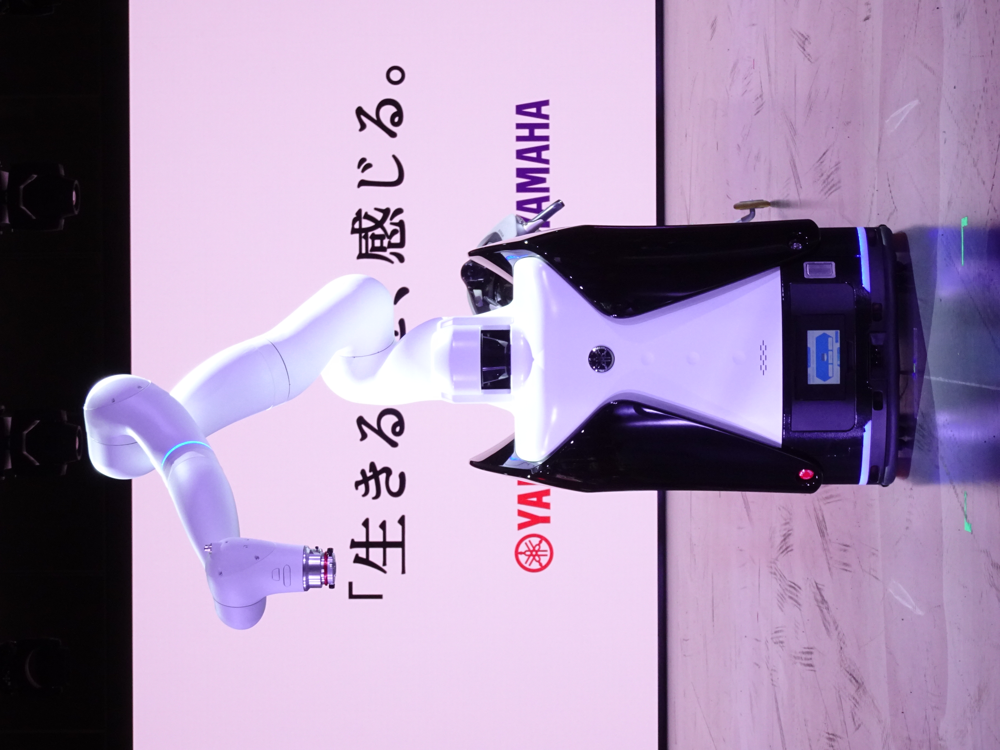
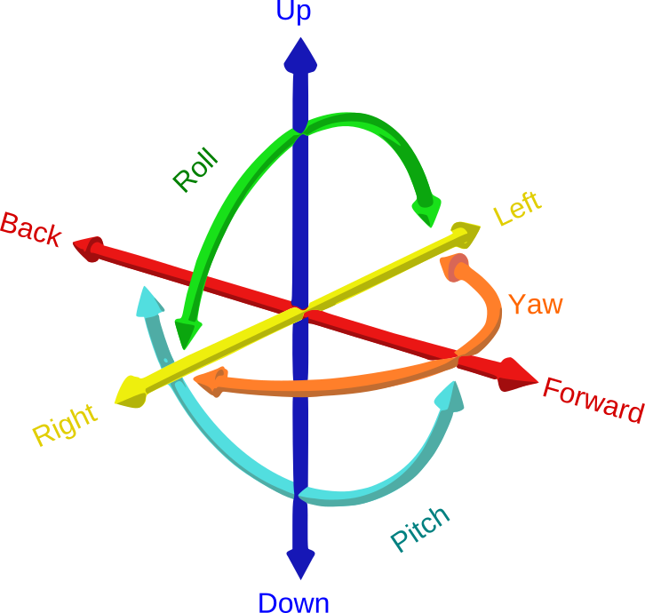

# 00 · 入门基础：协作机器人 / 自由度与关节

> 这是本仓库 `docs/` 里"使用说明"之外补上的**基础概念教程**。
> 目的是先讲清楚"UR10 是什么、机械臂怎么转"，再去读 `01-硬件与网络.md`、`03-机械臂控制.md` 等操作文档。
> 如果你已经能上手操作，这篇可以当速查。

---

## 1. UR10 是什么

UR10 是丹麦优傲机器人（Universal Robots，下称 **UR**）公司的**六轴协作机械臂**（cobot）。
UR 的经典产品线按负载/尺寸从小到大为 **UR3、UR5、UR10、UR16**；后来升级为 **e 系列**
（UR3e / UR5e / UR10e / UR16e）和更晚的 UR20 / UR30。

**UR10 的核心规格（CB3 代，本仓库设备）**：

| 参数 | 数值 |
|---|---|
| 轴数 / 自由度 | 6 轴（6 自由度），与人手臂类似 |
| 有效负载 | 10 kg |
| 工作半径 | 1300 mm |
| 重复定位精度 | ±0.05 mm（±0.10 mm 标称范围中有差异，以官方数据表为准） |
| 自重 | 约 33.5 kg |
| 控制柜 | CB3（本仓库是 CB3 代，软件 PolyScope URSoftware 3.15.8） |
| 协作特性 | 力/力矩受限、碰撞检测、安全区域可配置，可无护栏与人协同 |

本仓库实测的 UR10 序列号 `2022300602`，即属于 CB3 代。注意 **UR10 与 UR10e 不是同一款**
——e 系列是后一代（更高精度、力传感器增强、新的示教器），本仓库的配置与参数按 CB3 的 UR10 记。

在线数据表与介绍（取回页面时标注为不确定的均以官方最新为准）：

- UR 官网产品页：https://www.universal-robots.com/products/ur10-robot/
- UR DH 参数官方文章：https://www.universal-robots.com/articles/ur/application-installation/dh-parameters-for-calculations-of-kinematics-and-dynamics/

> ⚠️ **本仓库的操作文档（`docs/01`）记录的 IP、端口、标定结论都是针对"这台" UR10 的实测值**，
> 先读通本篇基础，再对照实测，不要拿通用资料里的数值覆盖本机标定结果。

---

## 2. 协作机器人（cobot）是什么

传统工业机器人大多要求装进 **安全围栏/安全光栅**，人机隔离。协作机器人（collaborative robot）
重点解决"让人和机器人**共享工作空间**"：

- **负载与速度可配置受限**：因为力/力矩一般不大，撞到人能伤害有限；
- **碰撞检测**：关节力矩超限或检测到外力时触发保护性停止（Protective Stop）；
- **力受限模式 / 拖动示教（手动牵引）**：可双手拖着机械臂走出轨迹，记录路径再回放；
- **安全区域（Safety Plane）**：在示教器上画禁区，进入即停。

UR 属于典型协作机器人。但协作不等于"绝对安全"——装了重负载、高速、尖锐工具后同样要隔离评估。

> 🖼 **协作机器人示意**（此图是 Yamaha 展品，仅用于示意"能在人附近作业的 cobot"，不是本仓库的
> UR10，型号以 `docs/01` 实测为准）：
>
> 
> 图源：[Wikimedia · File:Japan-Mobility-Show-2023-RuinDig 586.jpg](https://commons.wikimedia.org/wiki/File:Japan-Mobility-Show-2023-RuinDig_586.jpg)，
> 作者 RuinDig/Yuki Uchida，授权 **CC BY 4.0**。

本仓库的机器人末端装了 **Robotiq 夹爪 + ATI 力传感器 + 3D 相机**（见 `docs/01`），
重心明显偏置，因此**松刹车/上电前必须先扶住或确认姿态稳定**（`docs/01` 已强调）。

---

## 3. 六轴机械臂：自由度（DoF）

**自由度（Degree of Freedom, DoF）** 指机械臂独立可控的关节数。
六轴机械臂 = 6 个关节，一般用来在三维空间里**任意摆出"位置 + 姿态"**（共 6 个独立量：
3 个平移 + 3 个旋转）。

> 🖼 **6 自由度示意**（三个平移 + 三个旋转，CC BY-SA 4.0，作者 GregorDS）：
>
> 
> 图源：[Wikimedia · File:6DOF.svg](https://commons.wikimedia.org/wiki/File:6DOF.svg)，
> 授权 [CC BY-SA 4.0](https://creativecommons.org/licenses/by-sa/4.0/)。UR10 的自由度就是这 6 个
> （沿 x/y/z 移动 + 绕 x/y/z 转动）。

用人来类比：
- 3 自由度（如多数移动扫地机）：只能平面上前后左右转，够不到高，朝向也有限；
- 5 自由度：多数位置能到，但**姿态有约束**，某些朝向到不了；
- **6 自由度（UR10）**：空间中绝大多数点位 + 姿态都能到达，是通用装配/抓放/打磨的最低标准；
- 7 自由度（如部分高级协作臂）：冗余，可在固定末端位姿下改变"肘部"位置（避障/人体学）。

UR10 的 6 个关节从底盘到末端依次习惯命名为：

| 关节 | 名称 / 位置 | 大致对应人的部位 | 在仓库里的称呼 |
|---|---|---|---|
| Joint 1（J1） | 底座 / 基座旋转 | 腰 | 底座旋转 |
| Joint 2（J2） | 肩关节 | 肩 | 上臂摆动（大臂） |
| Joint 3（J3） | 肘关节 | 肘 | 前臂摆动 |
| Joint 4（J4） | 腕 1（沿小臂轴向旋转） | 腕部旋转 | 腕关节一组 |
| Joint 5（J5） | 腕 2（俯仰） | 腕部俯仰 | 腕关节一组 |
| Joint 6（J6） | 腕 3（末端工具旋转） | 手旋转 | 腕关节一组 |

**J4–J6 三个关节交于（近似同一个点的）"球腕"（spherical wrist）**，这是 UR 系列的典型结构，
正/逆运动学有现成解析解（见 `00-入门-运动学`）。

---

## 4. 关节运动范围与工作空间（workspace）

- **关节运动范围（Joint limits）**：UR10 每轴有转角限制（例如 J1 ±360°、J2 -360°~+360° 等，
  以官方数据表为准）。不要只按 `[-180°,180°)` 假设——本仓库 `docs/01` 实测到
  **控制器报告的关节角是连续角**，`J4 = -233.547°` 也是合法值。做限位/插值时用控制器原始值，
  **不要先归一化**（归一化会让插值路径反向绕行）。
- **工作空间（workspace）**：UR10 可达半径约 1.3 m，近似一个"球冠"（球缺）形状，
  但不是完整球——受关节限制、奇异位形、自碰撞约束，底座附近和身体正下方常常受限。
- **奇异位形（singularity）**：某些姿态下机械臂丧失某些方向的自由度（如大臂完全伸直、
  球腕对齐），表现为"末端想直线走但关节突然急剧加速"。见 `00-入门-运动学`。

---

## 5. 关节空间 vs 笛卡尔空间（两条"命令语言"）

这是理解所有机械臂操作的核心分界。`docs/01` 第 8 节已给出示教器上的两种点动方式，
这里补理论：

### 5.1 关节空间（Joint Space）
用 **6 个关节角**（`q = [q1, q2, q3, q4, q5, q6]`）描述机械臂状态。
- 优点：定义简单，不会"跑出可到范围"；接近关节限位、奇异位形的行为可控。
- 缺点：末端具体走到哪、朝向怎么变，**不直观**（要脑内"想一想"）。

UR 里关节角单位常用**弧度**，但示教器/URScript 也常用度。本仓库 `read_ur_state.py`
读 `q_actual`（关节角）、`tool_vector_actual`（TCP 位姿），详见 `docs/01`。

### 5.2 笛卡尔空间（Cartesian Space / Pose Space）
用 **末端工具的中心点（TCP）的位置 + 姿态**描述机械臂状态（见 `00-入门-坐标系与位姿`）。
- 优点：直观——"TCP 走到 (x,y,z)，朝向是斜向下 45°"。
- 缺点：机械臂内部其实没有"凭空" 6 个笛卡尔马达，必须由控制器**解运动学**（IK，见 `00-入门-运动学`）
  反推出 6 个关节角才能动；遇到奇异位形/无解姿态会失败。

> 一句话记忆：
> **关节空间 = 拧哪几个马达；笛卡尔空间 = TCP 在三维世界里走到哪、朝哪。**
> 示教器上"Move/点动笛卡尔"和本仓库的控制脚本本质都是：给目标位姿 → IK 解出关节角 → 伺服执行。

---

## 6. 一台完整的 UR 机械臂由什么组成

| 组成 | 作用 | 本仓库对应 |
|---|---|---|
| **机械臂本体（arm）** | 6 个关节马达 + 减速器 + 连杆 + 末端法兰 | UR10 本体 |
| **末端法兰（flange）** | 装工具的安装法兰，即 `flange` 坐标 | 法兰 → ATI 力传感器 |
| **控制柜（control box, CB3）** | 运行 PolyScope，执行程序、做运动学计算、跑安全层 | CB3 |
| **示教器（teach pendant / Polyscope 触摸屏）** | 人机界面：编程、点动、看状态、设置系统 | 随柜触摸屏 |
| 末端执行器（end effector） | 夹爪、吸盘等"手" | Robotiq 2F 夹爪 |
| 外围传感器 | 力/力矩、视觉 | ATI Net F/T、Mech-Eye PRO XS |

本仓库的"电脑"并不是机械臂的一部分，而是通过 IP 网络驱动它（见 `docs/01`、`docs/02`）。

---

## 7. 一套入门必看的知识链路

建议读文档顺序：

1. 本篇（协作机器人与自由度/关节）→ 知道"几个轴、怎么转"；
2. `00-入门-坐标系与位姿` → 知道"TCP/坐标系/姿态怎么表示"；
3. `00-入门-运动学` → 知道"位置和姿态怎么换算成关节角"；
4. `00-入门-TCP与末端与负载` → 知道"装了工具后中心点变成什么、重心在哪"；
5. `00-入门-PolyScope与URScript` → 知道"程序上怎么让机械臂动"；
6. 再回头读仓库 `docs/01`（本机实测网络/端口/标定）、`docs/03`（机械臂控制）。

---

## 8. 参考与进一步阅读

- UR 官网 UR10 产品页：https://www.universal-robots.com/products/ur10-robot/
- UR 官方协作安全介绍与安全手册：https://www.universal-robots.com/articles/safety-security/
- UR 官方 DH 参数：https://www.universal-robots.com/articles/ur/application-installation/dh-parameters-for-calculations-of-kinematics-and-dynamics/
- UR Academy 免费课程（中文入口）：https://academy.universal-robots.com/cn/