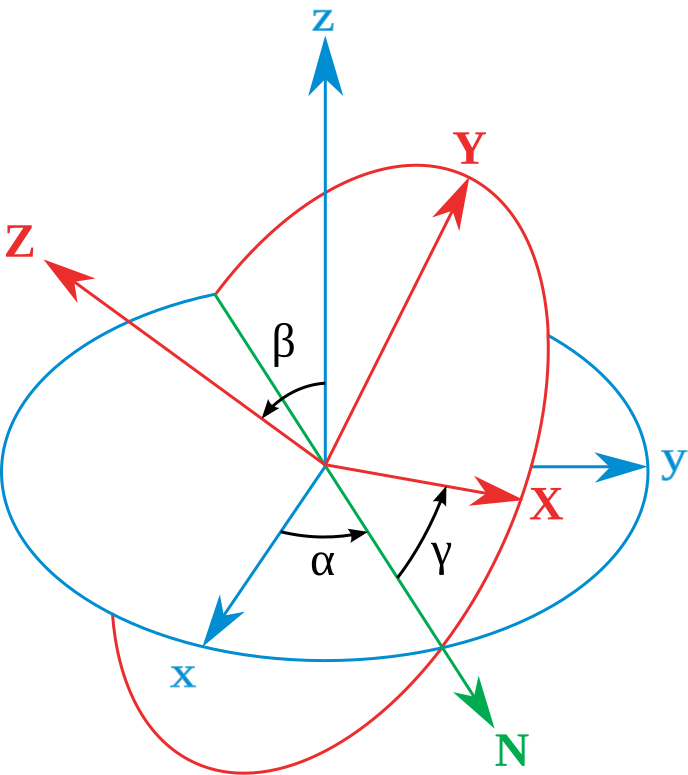

# 01 · 入门基础：坐标系与位姿

> 读这篇之前先看 `00-入门-协作机器人与自由度关节`。
> 这一篇讲清"位置 (position)"和"姿态 (orientation / pose)"在 UR 里是怎么表示的，
> 以及 base / flange / tool0 / TCP / 工具坐标系这些名词到底指什么。

---

## 1. 为什么机械臂需要"坐标系"

机械臂的 6 个关节角只能告诉我们**马达转到哪**，但要让机器人"把夹爪送到桌子上那杯水的正上方、
朝向向下"，我们需要建立一个**三维参考系**来描述空间位置和朝向。这个参考系就是坐标系（frame）。

UR 把空间里每一个"有名字、有原点、有朝向"的三维直角坐标系叫一个 **frame**。
`x` 向前、`y` 向左、`z` 向上（都是右手系，`x × y = z`）。

---

## 2. 几个关键 frame（UR 官方定义）

下面这张表是 UR ROS2 驱动文档（`ur_description`）中定义的 KDL/URDF 运动链，以及它们和
示教器（Polyscope）显示值的关系：

```
base_link
 ├ base            ← 与 base_link 同位置，但绕 Z 轴旋转 180°，与示教器 "Base" 参照一致
 └ base_link_inertia   （仅惯性/网格挂载用，运动学上等同 base）
    └ shoulder_link
       └ upper_arm_link
          └ forearm_link
             └ wrist_1_link
                └ wrist_2_link
                   └ wrist_3_link
                      └ flange
                      └ tool0
```

| frame 名 | 位置/含义 | 重要提示 |
|---|---|---|
| **base / base_link** | 底座坐标系，"世界"的锚点 | 示教器把某个参照设为 **Base** 时，读到的位姿就是相对 base |
| **flange** | 末端法兰（装工具的那个圆盘）中心 | 给自定义工具/ttool 挂载用；也是"机械臂摆出工具0位姿"的参考 |
| **tool0** | 正运动学算出的"工具坐标系"（工具全 0 配置时的 TCP） | 当系统工具设为"全 0"时，`tool0` ≈ 示教器显示的 TCP |
| **base_link** | 运动链根节点（遵循 REP-103：全零关节配置时臂朝向为 +X） | 与 base 同原点、差 180°，**做 TF 对比示教器数值时不能混用** |

> ⚠️ 重要差异（UR 官方 ROS2 文档明确提醒）：
> ROS/TF 里常用 `base_link`，但**示教器上读的位姿参照是 `base`**（绕 Z 轴转 180°）。
> 拿 ROS 里的 `tool0`-w.r.t-`base_link` 去和示教器"Base 参照 + 全 0 工具"的读数直接对，
> 会差一个 180° 方向的偏置。本仓库 `docs/01` 里"TCP 位姿读数要与示教器对照"时，用的就是
> 示教器自己的 `base` 约定。

---

## 3. 位置（Position）与姿态（Orientation / Pose）

一个"位姿"（pose）= **位置 + 姿态**，共 6 个独立量，对应 6 自由度。

### 3.1 位置：三个平移量
`(x, y, z)`，单位米，相对某个参照 frame 的原点。

### 3.2 姿态：三种常见表示法

| 表示法 | 内容 | 特点 / 在 UR 的使用 |
|---|---|---|
| **欧拉角 RPY（roll/pitch/yaw）** | 绕 X/Y/Z 依次转 `(rx, ry, rz)` | 直观；但**顺序敏感**、有万向节锁（gimbal lock）。UR 示教器状态里常见 RPY（单位弧度） |
| **旋转矩阵 R** | 3×3 方向余弦矩阵 | 适合做数学运算，不直观 |
| **四元数（quaternion）** | `(qx, qy, qz, qw)` | 无万向节锁、便于插值，是 ROS `geometry_msgs/Quaternion` 的格式 |

> 🖼 **欧拉角示意**（α-β-γ，CC BY 3.0，作者 Lionel Brits）——同一个姿态用连续三次旋转表示，
> 旋转**顺序**不同结果就不同，这正是 3.3 要强调的点：
>
> 
> 图源：[Wikimedia · File:Eulerangles.svg](https://commons.wikimedia.org/wiki/File:Eulerangles.svg)，
> 授权 [CC BY 3.0](https://creativecommons.org/licenses/by/3.0/)。

UR 的 URScript 里 `p[x, y, z, rx, ry, rz]` 就是"位置 + RPY"。本仓库 `read_ur_state.py`
读到的 `tool_vector_actual` 即这种 **TCP 位姿矢量**（位置 + 旋转矢量，见 `docs/01`）。

### 3.3 姿态为什么"顺序"这么重要
同一个末端姿态可以用**无数种**欧拉角组合表示，且**旋转顺序不同结果不同**。
做笛卡尔插值/IK（`00-入门-运动学`）时，务必先约定并统一用哪套约定（UR 用的是内置约定，
一般"先转哪个轴"由系统固定）。

---

## 4. 世界 / 基座 / 工具 / 工件：四种常用参照

做任务时你会反复用到这几类 frame：

1. **世界坐标系（World）**：整个工位的锚，比如桌面原点。
2. **基座坐标系（Base）**：UR 的 `base`，即上一节的底座 frame。UR 示教器里参照如设
   "Base" 就是从底座量位姿。
3. **工具坐标系（TCP / Tool）**：以**夹爪夹持点或工具尖端**为原点。装上 Robotiq、相机、
   笔尖等后，你要把 TCP 定义到真正"干活"的点（见 `00-入门-TCP与末端与负载`）。
4. **工件坐标系（Work Object / Feature）**：以**工件/桌面**为原点，便于对工件编程，
   工件移动时只改这个参照即可。

> 记忆：**同一个物理点，在不同参照下读数不同。**
> 做标定/对比时先问"参考系是谁"。（本仓库 `docs/11-机器人自身标定`、`docs/17-视觉自主抓取验收`
> 里大量"参照/坐标系"的坑，本质都是这个。）

---

## 5. 本仓库里"坐标系/位姿"相关的坑（实测提醒）

1. **TCP 位姿是"当前 TCP 定义"下的位姿**（`tool_vector_actual`），不一定是 `tool0`。
   当前控制器 TCP 是 `tool0`；`docs/11` 标定出笔尖/抓取 TCP 后，同一物理点读数整体改变，
   **历史点位必须先迁移**。（出处：`docs/01`）
2. **示教器 vs ROS 的 base 差 180°**：见第 2 节，别直接拿 `base_link` 读数对示教器。
3. **关节角是连续角**：`J4=-233.547°` 合法，插值/限位用原始值，别归一化。（出处：`docs/01`）
4. **位姿＝位置＋姿态**：读状态只看了 `x,y,z` 没看朝向，搬运/抓取一定偏。定位到"正上方"后还要核对朝向。

---

## 6. 参考

- UR 官方 ROS2 驱动文档 · Robot Frames（base_link/base/tool0/flange 与示教器关系）：
  https://docs.universal-robots.com/Universal_Robots_ROS_Documentation/rolling/doc/ur_description/doc/robot_frames.html
- REP-103 标准单位与坐标系惯例：https://ros.org/reps/rep-0103.html
- REP-199（base/tool0 帧提案）：https://gavanderhoorn.github.io/rep/rep-0199.html