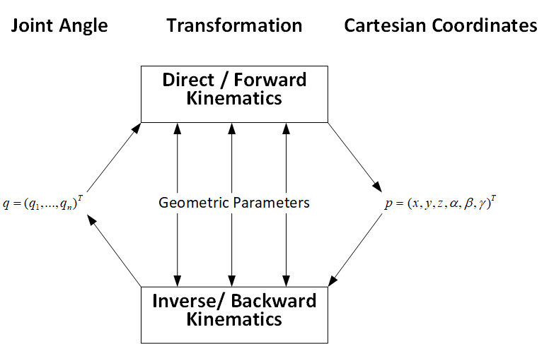
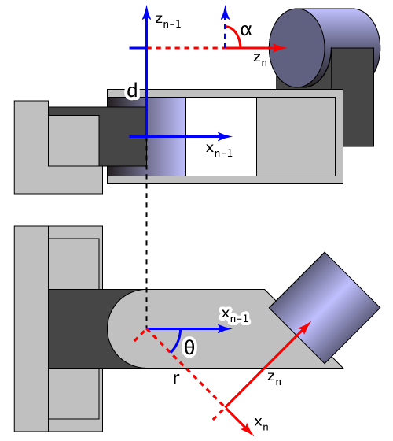

# 02 · 入门基础：运动学与 UR10 的 DH 参数

> 前置：`00-入门-协作机器人与自由度关节`（关节/笛卡尔空间）与 `01-入门-坐标系与位姿`（frame）。
> 这一篇讲"给定关节角→末端位姿（正运动学）"和"给定末端位姿→关节角（逆运动学）"，
> 以及 UR 官方公布的 **UR10 DH 参数表**。工程上你大多**不需要手算**，但理解了它才看得懂
> 奇异位形、IK 失败、以及本仓库大量标定/规划脚本在忙什么。

---

## 1. 正运动学（Forward Kinematics, FK）

已知 6 个关节角 `q = [q1..q6]`，算出末端（tool0 / TCP）在 base 下的位置与姿态。

- 方法：把每个关节的连杆变换 `T_i` 连乘 → `T_0^6 = T_1(q1)·T_2(q2)···T_6(q6)`。
- 结果**唯一**：给定 6 个角，末端位姿只有一个答案。
- 控制器给示教器显示 TCP/读 `tool_vector_actual`，本质就是 FK。

## 2. 逆运动学（Inverse Kinematics, IK）

反问题：给定末端位姿 **`(x,y,z, 姿态)`**，求出关节角 `q`。

- 结果**不唯一**：同一个末端位姿通常有多组解（肘上/肘下、腕翻转等）。UR 内置解法会挑选
  一组（按当前关节、行程、避免奇异）。
- **可能无解**：目标点超出可达范围、或姿态要求无法满足 → 报错/保护停。
- **接近奇异位形时**：末端要直线走，但某些关节角变化率逼近无穷，机器人会剧烈加速甚至触发
  protective stop（本仓库 `experiments/2026-09-14-ik-servoj-protective-stop.md` 就是在排查
  这类问题）。

> 🖼 **正/逆运动学对比**（CC BY-SA 4.0，作者 Haendy-freak）——左：FK（关节角 → 末端位姿；
> 唯一）；右：IK（末端位姿 → 关节角；多解）：
>
> 
> 图源：[Wikimedia · File:FWDvsINV Kinematics HighResTransp.png](https://commons.wikimedia.org/wiki/File:FWDvsINV_Kinematics_HighResTransp.png)，
> 授权 [CC BY-SA 4.0](https://creativecommons.org/licenses/by-sa/4.0/)。

> 工程结论：**笛卡尔运动不是"拍照就动"，要先当心 IK 是否有解、是否奇异。**
> 这也是本仓库"不执行电脑端流式 IK 真机运动"边界（README）背后的一条基础原理。

---

## 3. UR10（CB3）DH 参数表

UR 官方用 **Denavit–Hartenberg（DH）参数**来描述连杆几何。UR 官方注释：
> "UR 的 `a` 参数 = 维基百科 DH 里的 `r` 参数"

> 🖼 **DH 参数的 `a/d/alpha` 长什么样**（开放授权图，作者 Ethan Tira-Thompson，CC BY-SA 3.0）：
>
> 
> 图源：[Wikimedia · File:Sample Denavit-Hartenberg Diagram.png](https://commons.wikimedia.org/wiki/File:Sample_Denavit-Hartenberg_Diagram.png)，
> 授权 [CC BY-SA 3.0](https://creativecommons.org/licenses/by-sa/3.0/)。它展示的是**通用** DH 帧对，
> UR10 各轴代入的是下方表格的参数值。
>
> 在 `docs/06-入门-图片与授权清单.md` 里有更多开放授权/开源教程配图的来源对照。

| 关节 i | `a` [m] | `d` [m] | `alpha` [rad] |
|---|---|---:|---:|---:|
| 1 | 0 | 0.1273 | π/2 |
| 2 | -0.612 | 0 | 0 |
| 3 | -0.5723 | 0 | 0 |
| 4 | 0 | 0.163941 | π/2 |
| 5 | 0 | 0.1157 | -π/2 |
| 6 | 0 | 0.0922 | 0 |

> - `a`：相邻关节轴的公垂线长度（沿 x 方向）
> - `d`：沿 z 方向的偏移
> - `alpha`：绕 x 轴旋转的连杆扭转角
> - 该表是**标准 DH**，且相接关节平行处出现较大数值属正常（官方说明："standard DH 表示平行关节
>   时是奇异/敏感记法，期望出现大数代表小角度调整"）。
> - UR 官方同时给出动力学数据（每根连杆质量、质心、惯量矩阵）。UR 官方文章还说，
>   **惯量矩阵对于 UR3e/UR5e 可忽略，从 UR10 起开始有影响**——这正是本仓库做
>   `docs/11` 负载标定、`docs/12` 重力补偿的物理基础。

来源：官方 DH 文章 https://www.universal-robots.com/articles/ur/application-installation/dh-parameters-for-calculations-of-kinematics-and-dynamics/

> ⚠️ 型号区分就是这表的关键差异：UR10(CB3) 和 UR10e 的 **`a2`/`a3` 不同**（UR10e 为
> `-0.6127` / `-0.57155`，`d1` 也不同）。ROS/URDF 模型和你的 IK 库**必须与机型匹配**，
> 否则算出来的几乎每个位姿都偏。本仓库 `config/ur10_factory_calibration.yaml` 属于**这台**
> UR10 的标定，不要拿 UR10e 的参数覆盖。

---

## 4. 奇异位形（Singularity）简解

当雅可比矩阵（关节速度↔末端速度的映射）**降秩**时，某个方向无法再运动 → 奇异。

UR 常见三种：
1. **臂型奇异（shoulder singularity）**：肩/肘共线；
2. **腕奇异（wrist singularity）**：球腕 J4 与 J6 轴对齐；
3. **肘奇异（elbow singularity）**：肘关节接近伸直。

表现：末端想沿某个方向匀速，但某些关节角速度飙高；控制器保护停或路径突然扭转向。

**规避思路**：规划路径时加中间过渡位姿、避开极限姿态、用关节空间插值而非纯笛卡尔。

---

## 5. 本仓库会遇到运动学的地方

| 位置 | 用途 |
|---|---|
| `docs/01` 正运动学 | 读 `q_actual` → 算 TCP / 与示教器对照 |
| `docs/03` 机械臂控制 | 给目标位姿 → IK 解算（ROS 官方驱动/控制器） |
| `docs/11` 机器人自身标定 | TCP、负载、运动学标定（标定就是反过来求真实 DH/TCP） |
| `docs/12` 力传感器重力补偿 | 用姿态+质量估计力学模型，本质依赖几何与动力学 |
| `experiments/2026-09-14-*` | ik-servoj / protective-stop 排查 |

---

## 6. 进一步阅读

- 官方 DH 文章（含所有机型的表与 DH-Transformation.xlsx）：见上方链接
- DH 参数百科：https://en.wikipedia.org/wiki/Denavit–Hartenberg_parameters
- UR ROS2 `ur_description`（URDF/DH 实现）：https://github.com/UniversalRobots/Universal_Robots_ROS_Driver