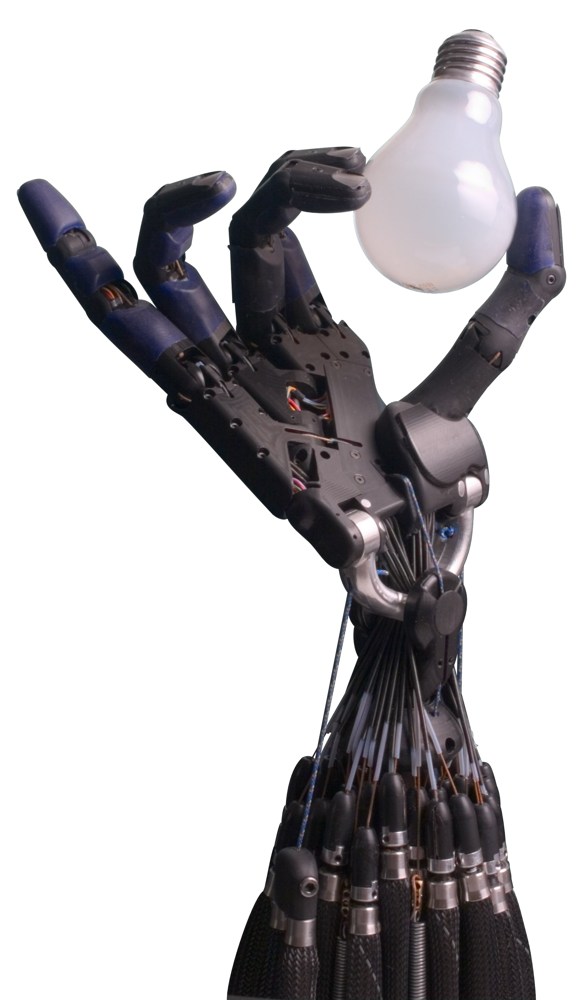

# 03 · 入门基础：TCP、末端执行器与负载

> 前置：`01-入门-坐标系与位姿`。这一篇讲 **TCP（Tool Center Point，工具中心点）** 这个概念，
> 为什么装了夹爪/相机后它很重要，以及"负载/重心"为什么会影响运动和力/力矩读数。

---

## 1. 什么是 TCP

**TCP = 工具中心点**，即你真正"干活"的那一点，也是坐标系的**工具原点**。
对 UR：

- 默认"全 0 工具"时，TCP 就是 **tool0**（法兰中心，见 `01-入门` 的运动链，`tool0`）。
- 装了**工具**（Robotiq 夹爪、吸盘、笔尖）后，真正的夹持点/笔尖并不在法兰中心，
  而在工具末端。UR 允许你**定义一个工具坐标系（TCP）**，让"控制/示教都相对那个点"。

一句话记忆：
> **TCP = "机器人心里认定的、就是要到达目标位姿的那个点"。**
> 你让机器人"去那个点"，去的是 TCP，不是法兰。

> 🖼 **末端执行器示例**（Shadow Robot 灵巧手，CC BY-SA 3.0，Richard Greenhill / Hugo Elias 摄）——
> "手（夹爪/末端执行器）"装在末端法兰上，其真实夹持点即 TCP；装了这种复杂工具后，TCP
> 往往不在法兰中心，必须标定：
>
> 
> 图源：[Wikimedia · File:Shadow Hand Bulb large Alpha.png](https://commons.wikimedia.org/wiki/File:Shadow_Hand_Bulb_large_Alpha.png)，
> 授权 [CC BY-SA 3.0](https://creativecommons.org/licenses/by-sa/3.0/)。

---

## 2. 为什么 TCP 如此关键（常见翻车点）

| 场景 | 不设/设错 TCP 的后果 |
|---|---|
| 抓放（Pick & Place） | 夹爪夹持点不在法兰中心，差一个工具长度 → 每次都抓偏 |
| 视觉标定（手眼） | 相机在法兰上的偏移没算进 TCP → 标出来的变换全偏 |
| 力控/重力补偿 | 工具重心相对 TCP/力传感器原点偏移，导致力读数不准 |
| 轨迹示教 | 让 TCP 走直线，工具姿态却可能剧烈翻转（因为绕 TCP 与绕法兰转不一样） |

本仓库里，末端装配链是 `法兰 → ATI 力传感器 → [偏心相机] + [正装夹爪]`，
**相机是偏心安装、重心有横向偏移**（`docs/01`），所以 TCP/负载标定直接决定抓取和力读数的对错。

---

## 3. 工具坐标系怎么"标"出来

UR 内置几种 TCP 标定方式（`docs/11` 有对应的实操记录）：
- **固定参考点法（Pointer）**：让 TCP 尖对准空间一个固定尖点，从多个不同姿态逼近，
  控制器反解出工具原点相对 tool0 的偏移；
- **多姿态拟合 / 由眼在手标定**：结合相机，用棋盘格/点云拟合 `工具TCP_Robot` 变换
  （本仓库 `handeye_eye_in_hand_*.yaml`、`gripper_grasp_center_*.yaml` 就是这类结果）。

标定完成后，同一物理点在不同 TCP 定义下读数会整体平移/旋转 ——
`docs/01` 强调"历史点位必须先迁移，不能混用"，就是这个原因。

---

## 4. 负载（Payload）与重心：为什么机械臂"变沉/力读数飘"

机器人末端装了夹爪 + 相机 + 力传感器，机械臂的自适应/碰撞检测和**力/力矩模型**都依赖
"工具的质量、重心、惯量"：

- **负载参数（payload / center of gravity, COG）**：告诉控制器"末端挂了多少、重心在哪"。
  设错 → 重力补偿错 → 示教器显示的工具重量不对、力传感器读数偏移、碰撞检测误报。
- **UR 官方**把负载/惯量标定当成系统参数（`docs/11`），本仓库还有专门的
  `docs/12-力传感器重力补偿.md`（记录了失败结论和限制）——说明**忽略负载/重心会带来系统性误差**。

> ⚠️ 一个常被忽略点：**机器人控制器的"负载"参数和机械臂本体质量不是一回事**。
> 影响运动/力矩的是"末端额外加载"的质量与位置。本仓库 `experiments/2026-09-18-力标定2倍质量矛盾诊断`、
> `experiments/2026-09-15-*重力标定*` 都在解决"加了工具后力读数不对/质量翻倍"这类问题。

---

## 5. 末端执行器：夹爪与吸盘

- **Robotiq 2F 二指夹爪**：本仓库用 Robotiq **ASCII 协议**，走机器人 `:63352`
  （`SET POS` 开合），详见 `docs/04-夹爪控制.md`。
- 夹爪的"夹持中心"是一个 TCP 候选：你要把 TCP 设到夹爪两指之间的中心，否则抓取对称轴位置会偏。
  本仓库有 `config/gripper_grasp_center_*.yaml`。

---

## 6. 参考

- UR DWG/CAD 与工具参考（`ur_description` 文档）：https://docs.universal-robots.com/
- Robotiq 官方夹爪手册（本仓库对应 `docs/04` 的取值来源）：
  https://robotiq.com/ （具体 2F-85/2F-140 ASCII 协议以官方手册为准）