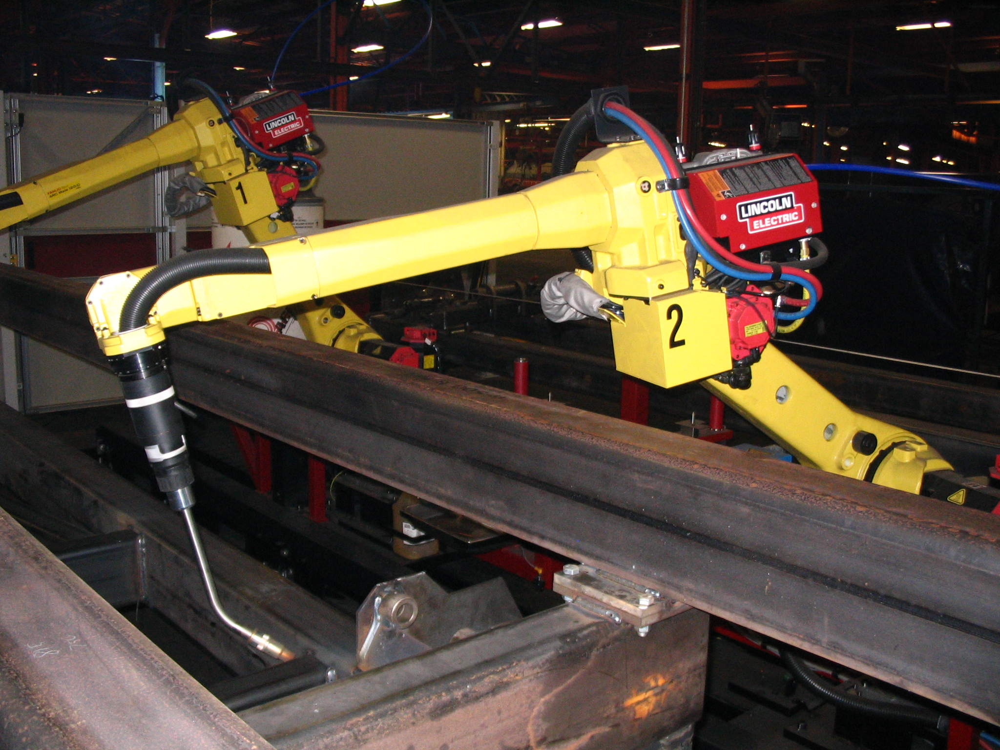

# 04 · 入门基础：PolyScope 与 URScript 编程入门

> 前置：`00-入门-协作机器人与自由度关节`、`01-入门-坐标系与位姿`。
> 这一篇讲"让机械臂动"的两条原生路径：**示教器 PolyScope 图形编程**和 **URScript 脚本语言**。
> 本仓库主要走 **ROS2 官方驱动 + 以太网**（`docs/02`、`docs/03`），但所有上层控制底层都落到
> URScript / 驱动。搞懂这篇，读脚本才不懵。

---

## 1. 两条编程路径

| 路径 | 在哪写 | 特点 |
|---|---|---|
| **PolyScope（图形）** | 示教器触摸屏 | 拖拽节点搭程序（Move、Set、Assign、If、While…），适合现场、目视化 |
| **URScript（文本脚本）** | 文字编辑器 / 通过端口下发（30002 / External Control） | 灵活、可移植、适合代码控制；UR 的命令语言 |

本仓库强调"机械臂不用碰示教器编程，夹爪不经示教器转发"（`docs/01`），走的是**电脑端程序/
URScript/ROS2 驱动**这条路，但底层命令模型与 URScript 一致。

---

## 2. PolyScope 图形编程（示教器）——最小概念

典型程序就是一张**程序树**，从上到下以"节点"执行：

- **Program 节点**：程序根节点；
- **Move 节点**：让机械臂移动，可设 **MoveJ（关节运动）/ MoveL（直线）**、目标位姿、速度/加速度；
- **Set 节点**：给变量赋值；
- **Assign/If/While**：流程控制；
- **Wait**：等待时间/条件。

关键点：示教器上"位置"看着都是 **TCP 位姿 + 参照坐标系（Base/工具/工件）**，
对应我们 `01/03` 讲的 frame 和 TCP 概念。

> 🖼 （示意：一台六轴关节机械臂，CC BY 3.0，作者 Phasmatisnox）——机械臂的编程/示教就在这类
> 设备上进行；UR 的具体示教器界面见官方 PolyScope 手册（本仓库 `docs/01` 有实测端口与界面流程）
>
> 
> 图源：[Wikimedia · File:FANUC welding robot reaching.jpg](https://commons.wikimedia.org/wiki/File:FANUC_welding_robot_reaching.jpg)，授权 CC BY 3.0。

---

## 3. URScript：最小语法入门

URScript 是一个类 C 的脚本语言，直接在 UR 控制器上运行。最常用几段：

```urscript
# 变量
a = 0.0
p1 = p[0.5, 0.1, 0.3, 0.0, 3.14159, 0.0]   # TCP 位姿：位置 + RPY(弧度)

# 关节运动：5 秒拉到 q 目标
movej([0.0, -1.57, -1.57, 0.0, 0.0, 0.0], a=1.2, v=0.25, t=5)

# 直线运动：沿工具坐标系向下 20mm（相对）
moves(p_offset=p[-0.0, 0.0, -0.02, 0.0, 0.0, 0.0], a=1.2, v=0.25, r=0)

# 读状态
actual_joint_positions()          # 关节角
get_forward_kin()                 # 末端位姿（tool0）
```

要点：
- 角度在 URScript 里**默认弧度**（`pi` 是常量）；
- `movej`（关节）/ `movel`/`moves`（直线）是几种核心运动指令；
- `p[...]` 是 **pose 类型**，即位置 + RPY；
- 变量可推导、可做流程控制，与 C 类似。

> 完整语法以官方 URScript 手册为准。本仓库的 `.urscript`（`legacy/pendant-socket/*`）和
> ROS 驱动的 `ur_robot_driver` 都在下发/执行这类指令。

---

## 4. 本仓库怎么控制（与 URScript 的关系）

- **官方 ROS2 驱动**（`docs/02`）：`ur_robot_driver` 通过 **External Control / 端口 50002**
  把 ROS 指令翻译成控制器执行的 URScript 调用，从而让你用
  `follow_joint_trajectory` / `servo` 等 Action 控制。
- **裸 URScript**：`docs/03` 另有直接往 **30002 Secondary Client** 下发 URScript 的历史方案
  （现不作为通用运动入口）。
- **状态读取**：与运动无关，是**只读**连 `30003/30013` 读状态帧，或连 `29999` Dashboard 发文本命令
  （`power on` / `brake release` / `play`…）——这些不属于编程，见 `docs/01`。

> 无论走哪条，最终都是"给目标（关节角或 TCP 位姿）+ 速度/加速度 → 控制器 FK/IK + 伺服执行"。

---

## 5. 入门练习建议

1. 用示教器 **MoveJ**点动、读 `read_ur_state.py` 与示教器对照（`docs/01` 第 8 节）；
2. 在模拟里写一小段 URScript（`movej`/`movel`），观察奇异性与速度；
3. 再看 `docs/05-完整抓放`、`docs/15`，把"控制三条通道"串起来（臂/夹爪/状态）。

---

## 6. 参考

- UR 官方 URScript 手册（Universal Robots Script Manual，随控制柜软件版本）：
  https://www.universal-robots.com/download/manuals-cb-series/
- UR Academy 免费网络课程：https://academy.universal-robots.com/cn/