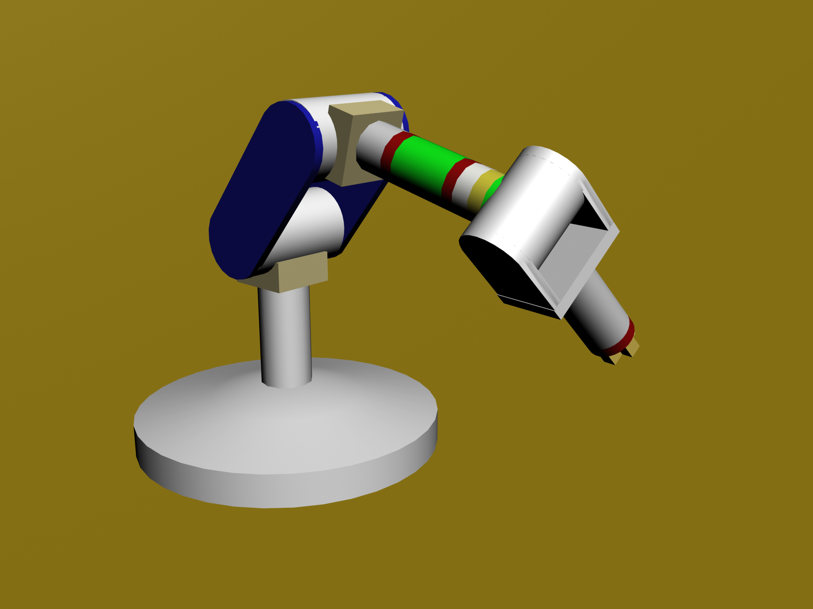

# 05 · 网上教程资源汇总（UR10 入门）

> 这些是网上可公开获取的 UR10 / 优傲协作机器人入门教程。
> 按"先理论 → 再官方手册 → 再 ROS/社区"顺序推荐。
> 与仓库实测不符的地方以仓库 `docs/` 的实测结论为准（本机 IP、端口、标定值是唯一的）。

> 🖼 （本教程"封面"：一节关节式机械臂的 3D 模型；公有领域，作者 NeD80）
>
> 
> 图源：[Wikimedia · File:Robot arm model 1.png](https://commons.wikimedia.org/wiki/File:Robot_arm_model_1.png)，授权 Public Domain。

---

## A. 官方入门（首选）

| 资源 | 链接 | 说明 |
|---|---|---|
| UR Academy 网络课程（中文） | https://academy.universal-robots.com/cn/ | 免费、分章节的视频/图文课程，含 e 系列核心教程 |
| UR10 产品页 / 数据表 | https://www.universal-robots.com/products/ur10-robot/ | 官方规格 |
| UR 官方手册下载（含 URScript 手册、用户手册） | https://www.universal-robots.com/download/ 与 /manuals-cb-series/ | CB3 用 Script Manual / User Manual |
| UR 官方 DH 参数文章 | https://www.universal-robots.com/articles/ur/application-installation/dh-parameters-for-calculations-of-kinematics-and-dynamics/ | 各机型 DH 表 + DH-Transformation.xlsx |
| UR 技术文章 / 知识库 | https://www.universal-robots.com/articles/ | 应用、安装、故障排查 |

## B. ROS1 / ROS2 驱动与仿真

| 资源 | 链接 | 说明 |
|---|---|---|
| UR 官方 ROS2 驱动文档（含 Robot Frames） | https://docs.universal-robots.com/Universal_Robots_ROS_Documentation/ | 本仓库 `docs/02` 依赖它 |
| Universal_Robots_ROS2_Driver 源码 | https://github.com/UniversalRobots/Universal_Robots_ROS2_Driver | `ur_robot_driver` / `ur_controllers` |
| UR ROS1 驱动（ur_driver） | https://github.com/UniversalRobots/Universal_Robots_ROS_Driver | 旧 ROS1 栈（本仓库 `docs/16` 历史对照） |
| `ur_tutorial`（UR10 ROS 教程包） | https://github.com/arthurrichards77/ur_tutorial | 社区给 UR10 写的 ROS 功能包教程 |
| ROS Wiki 机械臂服务（Survey of Arm/Trajectory Control） | http://wiki.ros.org/ | 概念参考 |

> 注：网上大量 UR 教程按 **UR10e/UR5e（e 系列）** 讲，本仓库是 **UR10 CB3**。
> e 系列与 CB3 在示教器界面（PolyScope 5）和部分指令/端口上不同，**对照时注意区分**，
> 别把 e 系列操作直接搬过来。（本仓库 `docs/01` 已记录本机是 PolyScope URSoftware 3.15.8。）

## C. 中文社区（CSDN / 知乎 / B 站，搜素关键词）

| 关键词 | 用途 |
|---|---|
| `UR10 六轴 协作机器人 入门` | 中文科普、结构讲解 |
| `Universal Robots 示教器 PolyScope 教程` | 图形编程步骤 |
| `URScript 教程 movej movel 基础` | 脚本入门 |
| `UR10 ROS moveit 编译 驱动` | ROS + MoveIt 打通流程 |
| `手眼标定 眼在手上 UR robotiq` | 视觉抓取流水线（对应本仓库 handeye 标定） |

> ⚠️ 社区教程**个体差异大、版本新旧不一**，出现与官方/本仓库不符时，**以官方文档和本仓库
> 实测结论为准**。本仓库 `config/`、`docs/`、`experiments/` 里的数字都是针对本机的。

---

## D. 按仓库内容对照的建议阅读顺序

1. 本篇 + `docs/00-入门-*` 五篇基础（协作/坐标/运动学/TCP/编程）；
2. 官方 URScript 手册对应章节；
3. 本仓库 `docs/01` → `docs/03`（机械臂控制）→ `docs/04`（夹爪）→ `docs/05/15`（完整抓放）；
4. 需要 ROS 再读官方 `Universal_Robots_ROS_Documentation`。

## E. 一条提醒

网上的"教程"只是引入门。**上真机前**：读完本仓库 `docs/00-当前可用操作.md`（哪些命令已验收、
哪些禁用），遵循 `docs/01` 的上电/松刹车安全流程，并只在已验收的实验方案授权下运动。