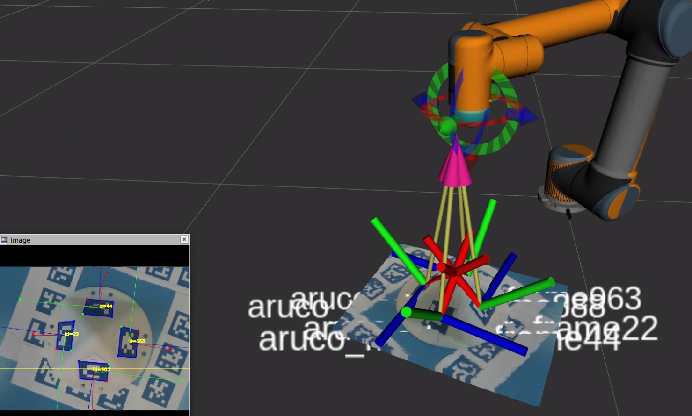

# 10 · 入门-标定原理：为什么标定 / 通用方法论

> 前置：`00-入门-协作机器人与自由度关节`、`01-入门-坐标系与位姿`、`02-入门-运动学`。
> 仓库 `docs/11、12、08` 记录了大量"标定"结论和失败。这一篇先把**标定到底是什么、为什么失败、
> 为什么"valid:false 不能上线"**的原理讲清楚，再分别看 `11-15` 各标定的数学。

---

## 1. 为什么要标定

机械臂/传感器**出厂有一个名义模型**（DH 参数、法兰位置、相机内参），但实际装配、安装、末端加装
工具后，**真实几何和名义几何有偏差**。标定（calibration）就是用**测量数据反推这些未知/偏差量**，
让"模型"与"实物"对齐。

一句话记忆：
> **标定 = 用已知的测量，解出模型里未知的那几个常数。**

本仓库每次"标定"都在解一个不同常数：

| 仓库里的标定 | 解什么常数 | 见 |
|---|---|---|
| TCP 标定（固定尖点回转法） | 工具原点相对 `tool0` 的平移 | `docs/11`、`11-入门-TCP` |
| 负载 / 重心标定 | 末端加载质量、重心、惯量 | `docs/11` |
| 工厂运动学标定 | DH 参数的实际偏差量 | `docs/11`、`config/ur10_factory_calibration.yaml` |
| 力传感器重力补偿 | 六轴偏置 + 质量/重心贡献的力/力矩 | `docs/12`、`13-入门-力补偿` |
| 相机内参标定 | 焦距、主点、畸变 | `docs/08`、`14-入门-相机` |
| 手眼标定（eye-in-hand） | 相机相对末端法兰的变换 | `docs/08`、`15-入门-手眼` |
| 夹爪抓取中心 | 夹持中心作为 TCP | `config/gripper_grasp_center_*.yaml`、`11-入门-TCP` |

---

## 2. 标定的通用三步：采集 → 拟合 → 独立验收

几乎所有标定都走这条套路，本仓库的守则就是按此定的：

1. **采集（采集样本）**：在多个不同位姿/姿态下，用测量设备（状态流、相机、力计）记录样本。
   - 采集量要**覆盖参数空间**（不同关节角、不同姿态、不同位置），只在一个姿态采是"退化的"，
     参数解不出来或不稳。
   - 本仓库要求记录**原始数据**（`/ft_sensor/wrench_raw`、`robot_frames.json`、样本 JSON），
     并存进 `outputs/` 可复现。
2. **拟合（solve / fit）**：把测量代入模型方程，用最小二乘/闭式解把未知常数解出来。
   - 会得到**条件数**（condition number）：条件数越大解越不稳 → 数值门禁（如 docs/11 的 TCP
     条件数 2.237 通过）。
3. **独立验收（holdout / independent validation）**：用**没参与拟合**的数据去验证，算误差（RMS、最大误差）。
   - 这是本仓库最重的一环：只在"拟合数据"上准、换新姿态就失效的模型判为**无效**。

> 🖼 举例：标定离不开"标定物"。下图是一种用于手眼标定的立体标定板（开源教程
> `pyni/handeye_calibration_with_depth_camera` README 图，非商用·内部学习）——相机靠它上面的
> 角点/二维码，稳定测出"相机→标定板"的位姿（即 `14` 讲的 PnP 输入）：
>
> 
> 来源：[pyni/handeye_calibration_with_depth_camera](https://github.com/pyni/handeye_calibration_with_depth_camera)。

> 所以仓库里大量 `valid: false`（如 `config/ft_gravity_*.yaml`）不是"没做"，而是**没通过独立验收**。
> 未通过验收的模型**不得上线**控制/力控/抓取判定（见 `docs/08、12`）。

---

## 3. 为什么一定要"独立验收"（一段真情感言）

机器学习的叫"过拟合"，机械臂标定里叫**只在采样位姿上自洽**：

- 拟合时残差很小，你觉得稳了；
- 换几个没采过的姿态，残差爆炸；
- 原因：参数解只是勉强满足采样点，但**模型本身不符合物理**，或参数耦合、样本退化。

本仓库 `experiments/2026-09-15-*重力标定*`、`2026-09-15-*全范围*` 都是"首次拟合看起来行、
独立姿态一验就垮"的真实案例。**判定是否有效，永远看独立验收，不看拟合残差。**

---

## 4. 标定的坐标变换链（贯穿所有标定）

标定本质都在解**未知的变换/偏移**，所有变换都在一条链上：

```
base ⇄ tool0(flange) ⇄ [TCP / 工具 / 相机 / 力计安装位置]
```

- 机器人自己算得动的是 **base→tool0**（FK，`02-入门-运动学`）；
- 工具/传感器相对法兰的偏移是**我们要求的东西**（TCP、手眼、重心偏移、抓取中心）；
- 每个标定就是：**已知链上一部分 + 测量 = 解出链上未知的那一段**。

示例（都拿公式解释在 `11-15` 展开）：

| 标定 | 已知 | 测量 | 未知 |
|---|---|---|---|
| TCP 回转法 | 各姿态 flange 位姿 | 指尖对准同一固定点 | TCP 平移 |
| 手眼 eye-in-hand | 各姿态 tool0 位姿 + 棋盘格 | PnP 给相机→棋盘格 | 相机→flange（AX=XB） |
| 重力补偿 | 各姿态 tool0 旋转 | 力计原始读数 | 偏置+质量/重心 |

---

## 5. 标定数据仍要遵守坐标系坑

复习 `01-入门-坐标系与位姿`：所有位姿都要明确参照系。
- 控制/视觉统一用 **base**，不能用 `base_link`（差 180°）；
- 标定采样时的 Tare/偏置状态要记录（`docs/12` 要求连 `/ft_sensor/software_bias` 一起存）；
- 换 TCP 后同一物理点读数整体变 → 历史点位先迁移。

---

## 6. 接下来看哪篇

| 想标什么 | 读 |
|---|---|
| 让机器人知道"手在哪"（TCP/抓取中心） | `11-入门-TCP与抓取中心标定原理` |
| 告诉控制器装了多重的工具、几何准不准 | `12-入门-负载重心与工厂运动学标定原理` |
| 力传感器读数要扣除重力和零点 | `13-入门-力传感器重力补偿原理` |
| 相机内部参数和"图像→3D" | `14-入门-相机内参与PnP原理` |
| 让"相机看到的"和"机器人坐标"对上 | `15-入门-手眼标定原理` |