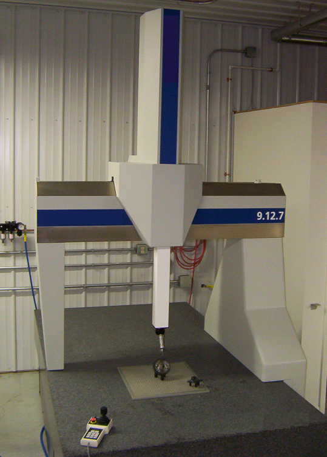

# 11 · 入门-标定原理：TCP 与抓取中心标定

> 前置：`01-入门-坐标系与位姿`（tool0 / TCP）、`10-入门标定-总览`（三步：采集→拟合→独立验收）。
> 仓库对应实操/结论：`docs/11`、`config/gripper_grasp_center_*.yaml`。

---

## 1. 要解什么

机器人只"知道" `tool0`（法兰）在 base 下的位姿。装了夹爪、吸盘、笔尖后，
**真正干活的点（TCP）不在法兰中心**，而是在一个未知的偏移上：

```
在 base 下：   P_tcp = P_tool0 + R_tool0 · t_tcp
                                        └── 未知的常量平移 t（从 tool0 到 TCP）
```

- `R_tool0`：当前法兰姿态（3×3 旋转矩阵，可由 FK 给出）；
- `t_tcp`：**我们要标定的未知平移**（3 个未知数）；
- 标定=用多次不同姿态下"TCP 瞄准同一点"的观测，把 `t_tcp` 解出来。

> 本仓库 `docs/11` 的 `left_fingertip_tcp` 标定最终得到
> `tool0 → 指尖 = [0.046606, -0.008747, 0.258853] m`，就是 `t_tcp`。

---

## 2. 固定尖点回转法（Pointer / Pivot method）的数学

做法：让 TCP（比如笔尖/闭合夹爪指尖）**反复对准空间同一个固定尖点 P**，
每次换一个法兰姿态记下当前 `(P_tool0_i, R_i)`。

> 🖼 **“用触头去测/碰空间固定点”的机器**（CMM 三坐标测量机，CC BY-SA 3.0，作者 Vulture19）——
> 它用触测探头去接触工件上的点，和 TCP 回转法“让工具尖反复对准空间中同一个固定点”的直觉一致
> （UR 机械臂回转法无需 CMM，这里仅借图示触测概念）：
>
> 
> 图源：[Wikimedia · File:9.12.17 Coordinate measuring machine.png](https://commons.wikimedia.org/wiki/File:9.12.17_Coordinate_measuring_machine.png)，
> 授权 [CC BY-SA 3.0](https://creativecommons.org/licenses/by-sa/3.0/)。

对第 i 个姿态：

　`P = P_i + R_i · t_tcp`

整理成线性形式（未知 `[t_tcp , P]`，共 6 个未知数）：

　`R_i · t_tcp − P = −P_i`

- 每个姿态给出 3 个方程；
- **≥2 个姿态**（6 方程）即可解，实际采 **N≥3** 制造冗余；
- 用最小二乘在全体姿态上求最优 `t_tcp`；
- **解的长相**：`t_tcp` 不随参考点 P 变，P 只是让封闭方程成立——TCP 与 P 都必须真实固定。

**几何直觉**：回转法把"工具绕固定尖点转动、所有姿态上交于同一球心"。解出来的 `t_tcp`
就是**球心相对法兰的位置** → 即 TCP。

---

## 3. 什么决定"能不能标准"

| 因素 | 影响 | 本仓库要求 |
|---|---|---|
| 姿态数量和分散度 | 太少/太接近→退化解不出来；太分散→覆盖好 | samp≥12，留出 holdout |
| **条件数（condition number）** | 数值越大解越不稳、对噪声越敏感 | 如指尖 2.237 通过 |
| 指针对准精度 | 人类手的抖动、固定点是否真固定 | 静止门禁、留出验证 |
| 独立验证 | 换未参与的姿态再对准同点复核 | 末 3 个留出样本 RMS/MAX 误差 |

> 本仓库 `docs/11` 明确：回转法**只标定指尖位置（t_tcp）**，坐标轴仍继承 `tool0`，
> 不能由此推断夹持方向或直接授权抓取——因为抓取还涉及"手指朝哪、夹持中心在哪"。

---

## 4. 抓取中心（Grasp Center）标定

夹爪的"抓取中心"是**两指之间的夹持中心点**，是抓放任务的真实 TCP：

- 需要把夹爪几何（指厚、指距、安装偏移）和实际夹持状态（开/闭角度）一起定义；
- 本仓库有 `config/gripper_grasp_center_20260922.yaml`、`config/manual_grasp_alignment_*.yaml`；
- 与指尖 TCP 不同，抓取中心要结合**夹爪朝向**和**物体尺寸**判断，不能只用回转法。

用一句话：
> 指尖 TCP = "机器人的笔头在哪"；抓取中心 = "夹爪合上后夹住的那个点在哪"。
> 前者解决了"触及"，后者才能保证"抓得正"。

---

## 5. 标定出来以后要注意

1. **同一物理点在不同 TCP 定义下读数整体变**（`01-入门`）：标完新 TCP，历史点位必须先迁移；
2. **被指认的 TCP 是否被控制器"当前激活"**：`docs/11` 强调标定前要在示教器确认激活 TCP 为零/法兰；
3. **任何非独立验收的 TCP 都不能用于抓放/书写**：先复核一致性再授权。

---

## 6. 参考

- 仓库 `docs/11`（本机指尖 TCP 结果与门禁）
- OpenCV `solvePnP`/最小二乘文档：https://docs.opencv.org/（TCP 求解同属线性 LS，可参考其线性代数工具）
- UR 官方 URScript 手册中关于 TCP/工具坐标部分：https://www.universal-robots.com/download/manuals-cb-series/