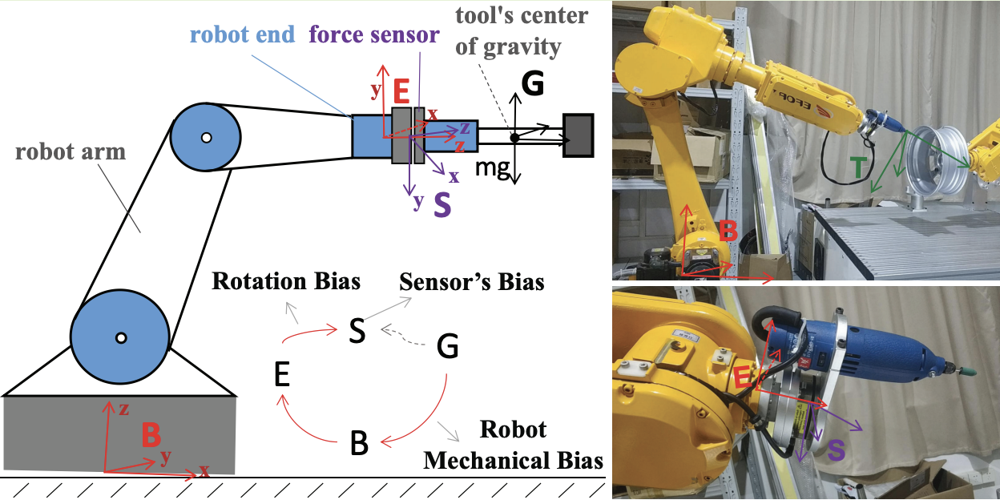

# 13 · 入门-标定原理：力传感器重力补偿

> 前置：`01-入门-坐标系与位姿`、`02-入门-运动学`、`10-入门标定-总览`。
> 仓库对应：`docs/08`（ATI 通道）、`docs/12`（重力补偿）、`config/ft_gravity_*.yaml`、
> `experiments/2026-09-1?-*重力标定*`。**这是本仓库失败记录最多的标定**，原理必须清楚。

---

## 1. 问题的本质：力传感器测到的不只是"接触力"

末端装了六维力传感器，它**静止悬挂一件工具**时读数不是零——它在承受**工具的重量**：

- 一个质量 m、重心在 COM 偏移 r 处的工具，对传感器施加：
  - **力**：`F = m · g`（重力），方向随机械臂姿态变化（工具转，重力方向不变）；
  - **力矩**：`T = r × F`（重力不作用在传感器原点，造成力矩）；
- 再加上传感器自身的**零点偏置（bias / 温漂）**。

所以：
```
wrench_raw（原始六轴读数） = 零点偏置(b) + 重力引起的力/力矩(g(q) · 参数) + 真实接触力(想要的)
```
**重力补偿 = 把"零点偏置 + 工具重力分量"建模并在读数里扣掉，剩下的才是接触力。**

> 🖼 **力/力矩重力补偿模型示意**（来自开源仓库 `GeneHit/hand_force_calibration`，README 中的
> `modeling.png`，即"静态（stationary）重力补偿模型"）——它画的正是上面这个思路：六维力传感器
> 读数 = 接触力 + 重力(经姿态旋转) + 偏置；模型与论文《Bias Estimation and Gravity Compensation
> for Wrist-Mounted Force/Torque Sensor》一致。**仅供实验室内部学习，非商用**：
>
> 
> 来源：[GeneHit/hand_force_calibration](https://github.com/GeneHit/hand_force_calibration) 的
> README（按该仓库 LICENSE 使用，本文档按非商用·内部学习用途引用）。

---

## 2. 数学模型与"为什么能线性最小二乘"

重力在传感器坐标系里的方向随姿态变化，用 FK 得到工具姿态旋转矩阵 `R`（见 `01/02-入门`），
把 base 下的重力方向转到传感器/工具系：

```
g_sensor = R_base_toolᵀ · g_base        ← 本仓库 docs/12 已验证这个方向是对的
F_gravity = m · g_sensor + b_F
T_gravity = (m·r) × g_sensor + b_T       ← 力矩 = 重心偏移(m·r) 叉乘重力 + 偏置
```

**关键性质**：
- 写法里 `m`、`m·r`、`b` 都只是**线性倍数**；
- 因此对一组静态姿态的测量 `y`，可写成 **线性方程 `y = Φ(q) · x + 噪声`**，
  未知向量 `x = [b_F, b_T, m·g 相关, m·r 相关]`；
- **最小二乘**闭式解出 `x` 即可 —— 这是它能自动拟合的数学依据。

---

## 3. 为什么机架/环境条件影响这么敏感

重力补偿参数**强烈依赖测量条件**：
- **必须静态、无接触**：有真实接触力时，模型被污染；
- **线缆/走线不能变**：绊着的线会对传感器施力，`docs/12` 就要求"线缆走线不变"；
- **姿态要覆盖够**：只在某个朝向采样，`g_sensor` 不再能拆出 `m` 和 `b`（退化），
  或只能拟合局部 → 独立姿态必挂。

> 这正是仓库 `experiments/2026-09-15-*全范围/朝下*` 失败的根因之一：首拟合好看、换姿态就崩。

---

## 4. 仓库的工程守则（对应上面原理）

1. **用原始话题 `/ft_sensor/wrench_raw` 拟合**（不含进程内 Tare），并同时存
   `/ft_sensor/software_bias`（`docs/12`）——因为"扣了什么偏置"本身是参数，不可丢；
2. **必须多姿态独立验收**，未通过的模型维持 `valid: false`，**不得**用于碰撞停止/恒力/插装/抓取判定；
3. **坐标方向已验证**：重力向量用 `R_base_tool.T @ g_base`，反着和真机不符（`docs/12`）；
4. 结论别乱写：就算补偿模型方向对了，**质量、重心、偏置参数仍可能不可用**。

---

## 5. 一个典型翻车案例（本仓库）

`experiments/2026-09-11-重力补偿标定与失败验收`：
- 之前候选在静态、无接触、走线不变的**特定**条件下通过；
- 一旦加入没参与拟合的新静态姿态，结果垮掉；
- 因为参数是在**退化/狭窄采样**上拟合的，模型并没有学到真实的 `m·r` 和偏置。

教训 = `10-入门标定` 的通用三句话：**采集覆盖全、拟合看条件数、判有效性只看独立验收。**

---

## 6. 参考

- 仓库 `docs/08`、`docs/12`、`config/ft_gravity_*.yaml`、`experiments/2026-09-1?-*`
- ATI 六维力协议（RDT UDP）：见仓库 `scripts/ati_netft_node.py`
- 力/力矩向量叉乘、旋转矩阵的线性最小二乘，可参考机器人学教材基础章节