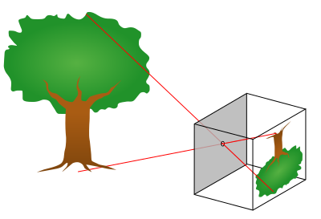
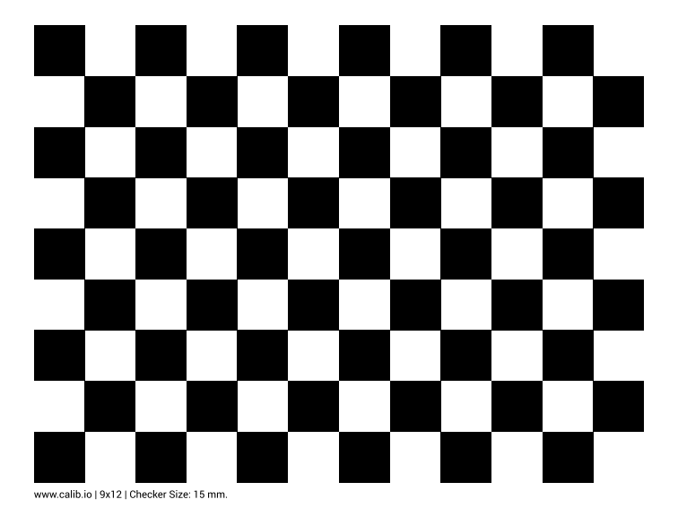

# 14 · 入门-标定原理：相机内参与 PnP

> 前置：`01-入门-坐标系与位姿`、`02-入门-运动学`、`10-入门标定-总览`。
> 仓库对应：`docs/08`（Mech-Eye）、`handeye_eye_in_hand_*.yaml`；
> 本仓库相机是 **Mech-Eye PRO XS**，配合手眼标定做视觉抓取。

---

## 1. 相机把"3D 世界"变成"2D 像素"，需要内参

相机成像本质是把三维点投影到图像平面。**内参（intrinsics）** 描述这一投影的固有属性：

```
像素坐标 (u, v) = 内参矩阵 K · [ R | t ] · 3D点(X,Y,Z,1)

K = [fx  0  cx]
    [ 0  fy  cy]
    [ 0   0   1 ]
```

> 🖼 **针孔相机投影模型**（公有领域，原图 `en:User:DrBob`，SVG 重绘 `en:User:Pbroks13`）：
>
> 
> 图源：[Wikimedia · File:Pinhole-camera.svg](https://commons.wikimedia.org/wiki/File:Pinhole-camera.svg)，
> 授权：**Public Domain（公有领域，无需署名）**。它演示三维点如何过镜头中心投影到像平面——
> PnP 就是在已知这个投影关系后反求相机位姿。

- `fx, fy`：焦距（单位像素，其实 = 物理焦距 / 像素尺寸）；
- `cx, cy`：主点（光轴与图像平面的交点，理想在图像中心）；
- 再加 **畸变（distortion）**：镜头带来的桶形/枕形畸变 `(k1,k2,p1,p2...)`。

**内参标定** = 用已知几何的标定物（最常见是棋盘格/圆点板，多姿态拍照）反推 `fx,fy,cx,cy` 和畸变。
本仓库 `docs/08` 用棋盘格角点做视觉验证，用的就是这条思路。

> 🖼 **棋盘格标定板**（开源教程 `RealManRobot/hand_eye_calibration` README 里的标定板图，供打印）：
> 粗黑格角点能被 `findChessboardCorners` 稳定检出，用作相机内参标定和 PnP 的 3D-2D 对应点。
> **仅供实验室内部学习，非商用**：
>
> 
> 来源：[RealManRobot/hand_eye_calibration](https://github.com/RealManRobot/hand_eye_calibration) 的 README。

---

## 2. PnP：已知"3D 点 ↔ 2D 点"求相机位姿

**PnP（Perspective-n-Point，透视 n 点）** 解决："已知物体上 n 个 3D 点以及它们在图像里的 2D 像素，
求相机（相对物体）的位姿 R、t"。典型做法：

1. 在标定物上取角点，得到 3D 坐标（在物体坐标系）与其 2D 像素；
2. 用优化使这些点的 **重投影误差**最小：
   `min Σ || 像素观测_i − 内参K·(R|t)·3D_i ||²`；
3. 输出 `R, t`（相机外参）。

**重投影误差**是这套的核心质量指标：把解出的 R,t 再投影回去，看和观测差多远。
本仓库 `docs/08` 报告"棋盘格逐角点 PnP–点云几何误差 RMS 0.692 mm"，就是在量化这一步准不准。

---

## 3. 内参与 PnP 从哪来 → 与"手眼标定"的关系

单独的内参/PnP 给出的是**相机相对棋盘格**的位姿；要做"视觉→机器人抓取"，还要把相机位姿
换算成机器人/机械臂坐标，这一步是 **手眼标定（eye-in-hand）**，见 `15-入门标定-手眼`。

链路：
```
[棋盘格3D点] --内参+PnP--> 相机→棋盘格位姿 --手眼X--> 法兰→棋盘格 --FK--> base→棋盘格
```

---

## 4. 本仓库相机注意点

1. **PRO XS 2D 是单色（硬件规格）**，`docs/08` 已验证：bgr8 三通道逐像素相同，不是配置错误，
   **不要当彩色识别**。单色对棋盘格/角点/点云反而更稳。
2. 视觉目标一律用 **base** 坐标表达，不能用 `base_link`（差 180°，见 `01-入门`）。
3. PnP 解得好不等于"物块中心定位准"：本仓库指出"棋盘格误差小，但真实物块中心仍未独立验收"，
   所以上真机抓取前仍需独立核实。
4. 相机 SDK 版本、触发、点云/深度均已完成验收（`docs/09`）。

---

## 5. 参考

- UR 官方 ROS 相机 / Mech-Eye 文档与仓库 `docs/08、09`
- OpenCV 相机标定与 PnP：https://docs.opencv.org/4.x/（`calibrateCamera`、`solvePnP`）
- Zhang 标定法原理可参考 OpenCV 教程"Camera Calibration"章节：https://docs.opencv.org/4.x/dc/dbb/tutorial_py_calibration.html