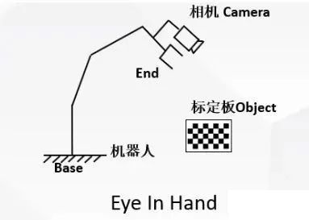
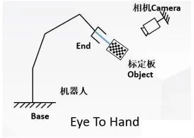
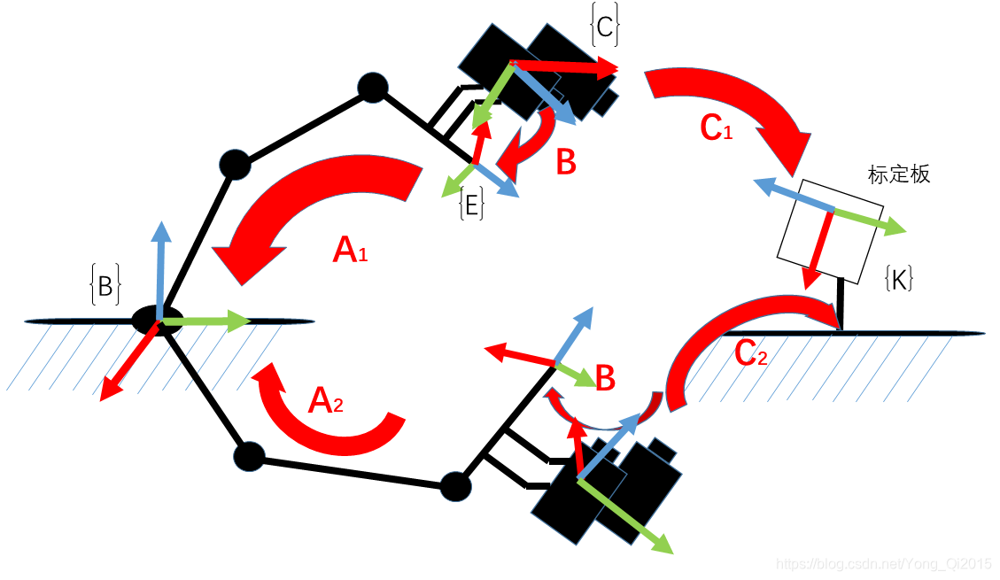

# 15 · 入门-标定原理：手眼标定（eye-in-hand, AX=XB）

> 前置：`01-入门-坐标系与位姿`、`02-入门-运动学`、`14-入门标定-相机内参与PnP`、
> `10-入门标定-总览`。仓库对应：`docs/08`（当前用 eye-in-hand）、`config/handeye_eye_in_hand_*.yaml`、
> `docs/17-视觉自主抓取验收`、`experiments/2026-09-17/18-眼在手*`。

---

## 1. 手眼标定解决什么

相机"看到物体"得到的是**相机坐标系**里的位置；机器人要去抓它，得换成**机械臂/基座坐标**。
从相机到机械臂中间隔着一段**未知的固定变换——相机装在末端（eye-in-hand）还是别处**，这就是"手"和"眼"
的关系，标出来就叫**手眼标定**。

两种装法：

| 装法 | 相机在哪 | 标什么 | 记法 |
|---|---|---|---|
| **Eye-in-Hand（眼在手上）** | 相机随末端法兰一起动 | 相机→法兰 的固定变换 X | **AX = XB** |
| **Eye-to-Hand（眼固定在外）** | 相机固定在环境里 | 相机→基座 的固定变换 | **AX = BX** / 变种 |

本仓库当前是 **eye-in-hand（眼在手上）**：相机随末端运动，棋盘格固定（`docs/08`）。

> 🖼 **两种装法图示**（开源教程 `RealManRobot/hand_eye_calibration` 的 README 原图）：
> 左=眼在手上（相机装末端、随机械臂动）；右=眼在手外（相机固定在外）。**仅供实验室内部学习，非商用**：
>
> 
> 
> 来源：[RealManRobot/hand_eye_calibration](https://github.com/RealManRobot/hand_eye_calibration) 的 README。

---

## 2. eye-in-hand 与 AX=XB 的推导

设每个测量姿态：

- `A_i`：**相机位姿的相对变化**（两次采样间，相机相对棋盘格的变化，由 PnP 得到）；
- `B_i`：**末端法兰位姿的相对变化**（两次采样间，法兰相对 base 的变化，由 FK 得到）；
- `X`：我们要的 **相机→法兰** 固定变换。

同一个小闭环闭合后，可推导出不变式：

```
        A · X = X · B        （每个姿态对给一个这样的方程）
相机姿态变化(a) 乘上 相机到法兰(X)  =  相机到法兰(X) 乘上 法兰变化(b)
```

把多次姿态的方程联立，用分离旋转/平移或李代数的最小二乘解出 **X**。
这就是经典的 **AX=XB** 手眼标定方程。

> 🖼 **AX=XB 的"变换回路"图**（OpenCV 教程思路、图为开源教程
> `RealManRobot/hand_eye_calibration` 的"机械臂运动到两个位置，构建变换回路"）
> ——它把"两个相邻姿态间的机械臂变化（A）与相机变化（B），乘上未知的相机↔末端固定变换（X）
> 后必须闭环自洽"画成回路，正是 AX=XB 的几何意义。**仅供实验室内部学习，非商用**：
>
> 
> 来源：[RealManRobot/hand_eye_calibration](https://github.com/RealManRobot/hand_eye_calibration) 的 README。

> 直觉：相机移动了多少、和法兰移动了多少，"转一圈再回来"必须自洽，这个自洽量就锁定了
> X。姿态越多、转得越散，X 解越稳（和 `10-入门标定` 的"采集覆盖"一致）。

---

## 3. eye-in-hand 标定的实操步骤（对应本仓库）

1. 固定棋盘格，机器人带相机摆**多个不同姿态**拍棋盘；
2. 每姿态：保存 `robot_frames.json`（FK 给法兰位姿）+ 相机图/角点（PnP 给相机→棋盘）；
3. 用棋盘格角点标出 `相机→棋盘`，再代入 AX=XB 解 `X = 相机→法兰`；
4. 结果存 `config/handeye_eye_in_hand_*.yaml`；
5. 用未参与的姿态**独立验收**（重投影/点云几何误差），不合格维持无效，不得用于抓取。

> 本仓库 `docs/08`：手眼参数建立在官方工厂运动学之上，`base→tool0` 用官方 FK；
> 视觉目标必须用 `base` 坐标表达，不能用 `base_link`。

---

## 4. 为什么手眼标定"看着好了还会翻车"

1. **姿态太少 / 旋转不够散**：AX=XB 需要充分的相对旋转，只平动不解稳；
2. **棋盘格被测不准**：角点亮度、清晰度影响 PnP，进而影响 A（`14-入门`）；
3. **标定全过程机械臂/相机没锁死**：抖动、焦距漂移会污染样本；
4. **坐标系用错**：`base` vs `base_link` 差 180°，混用直接炸（`01-入门`）；
5. **独立验收缺失**：只在拟合样本上准 → 换姿态就偏（`10-入门标定`）。

本仓库 `experiments/2026-09-17、18-眼在手*` 记录了多次校验/重标定的过程，正是覆盖上面这些点。

---

## 5. 参考

- 仓库 `docs/08`、`config/handeye_eye_in_hand_*.yaml`、`experiments/2026-09-17/18-眼在手*`
- 经典 AX=XB 求解与综述见 OpenCV `handEye()`（eye-in-hand）文档：https://docs.opencv.org/4.x/
- 开源平台手眼标定教程（中文）：https://develop.realman-robotics.com/AI/developerGuide/hand/